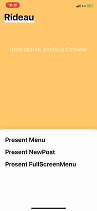
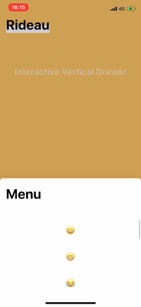

# 🎪 Rideau

Rideau is a drawer UI similar to what Apple's apps use. (e.g Maps, Shortcuts)

> 🚀 Rideau is in release candidate!




## Overview

- 💎 Multiple snap points (e.g. most hidden, half visible, full visible, and we can add more snap points.)
- 💎 Animations alongside moving (e.g. dimming background color)
- 💎 Completely handling scrolling of scrollview inside RideauView
- 💎 Ability to resize based on intrinsic content size of view that RideauView has

RideauView allows for flexible snap points.
`Snap points` pertains to specified offsets where the draggable view "snaps to" when the dragging has ended.
There are usually 2 or 3 snap points.

---

Objects we will commonly use:

- RideauView
- RideauViewController
- RideauSnapPoint

`RideauView` is the core object in this library.
We typically add our own view to RideauView.

`RideauViewController` contains a `RideauView`.
It allows us to present the RideauView as modal dialog.

`RideauSnapPoint` defines where the content view stops.

## 🔶 Requirements

iOS 10.0+
Xcode 10.1+
Swift 4.2+

## 📱 Features

- [x] Multiple snap-point
- [x] Smooth integration with dragging and UIScrollView's scrolling.
- [x] Tracking UIScrollView automatically
- [x] Set UIScrollView to track manually
- [x] Use UIViewPropertyAnimator between snap-points.

## 👨🏻‍💻 Usage

### Present inline

```swift
let rideauView = RideauView(frame: .zero) { (config) in
  config.snapPoints = [.autoPointsFromBottom, .fraction(0.6), .fraction(1)]
}
  
let someView = ...

rideauView.containerView.set(bodyView: container.view, options: .strechDependsVisibleArea)
```

### Present with Modal Presentation

```swift

let targetViewController: YourViewController = ...

let controller = RideauViewController(
  bodyViewController: targetViewController,
  configuration: {
    var config = RideauView.Configuration()
    config.snapPoints = [.autoPointsFromBottom, .fraction(1)]
    return config
}(),
  initialSnapPoint: .autoPointsFromBottom
)

present(controller, animated: true, completion: nil)
```

### Multiple SnapPoints

We can define snap-point with `RideauSnapPoint`.

```swift
public enum RideauSnapPoint : Hashable {
  
  case fraction(CGFloat)
  case pointsFromTop(CGFloat)
  case pointsFromBottom(CGFloat)
  case autoPointsFromBottom
}
```

```swift
config.snapPoints = [.pointsFromBottom(200), .fraction(0.5), .fraction(0.8), .fraction(1)]
```

### ⚙️ Details

RideauContainerView has two ways of resizing content view which is added.

* `RideauContainerView.ResizingOption`
  * noResize
  * resizeToVisibleArea
  
```swift
final class RideauContainerView : UIView {
  public func set(bodyView: UIView, resizingOption: ResizingOption)
}
```

### 🔌 Components

Rideau provides the following components that may help us.

#### RideauMaskedCornerRoundedViewController

A Container view controller that implements masked rounded corner interface and has some options.

- [ ] More customizable

```swift
let targetViewController: YourViewController = ...
let toDisplayViewController = RideauMaskedCornerRoundedViewController(viewController: targetViewController)

let controller = RideauViewController(
  bodyViewController: RideauMaskedCornerRoundedViewController(viewController: target),
  ...
```

#### RideauMaskedCornerRoundedView

- [ ] More customizable


#### RideauThumbView

- [ ] More customizable


## Installation

### CocoaPods

Rideau is available through [CocoaPods](https://cocoapods.org). To install
it, simply add the following line to your Podfile:

```ruby
pod 'Rideau'
```

### Carthage

For [Carthage](https://github.com/Carthage/Carthage), add the following to your `Cartfile`:

```ogdl
github "muukii/Rideau"
```

### What's using Rideau

- [Pairs](https://itunes.apple.com/tw/app/id825433065)

## Author

- [Muukii(Hiroshi Kimura)](https://github.com/muukii)

## Contributors

- [John Estropia](https://twitter.com/JohnEstropia)

## License

Rideau is released under the MIT license.
