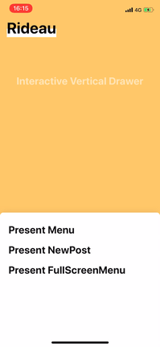
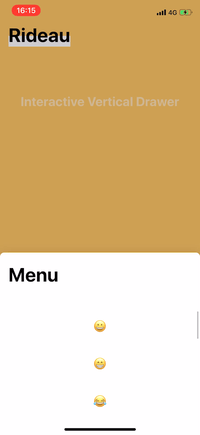

# Rideau

Rideau is a UIKit drawer / bottom sheet library for iOS, inspired by the sheet interfaces used in apps like Maps and Shortcuts.




## Current Scope

- UIKit-first API for iOS bottom sheets
- Inline embedding with `RideauView`
- Modal presentation with `RideauViewController`
- Multiple snap points such as `.hidden`, `.pointsFromBottom`, and `.fraction`
- Automatic coordination with `UIScrollView` content inside the sheet
- Self-sizing content via `RideauContentType`
- Interruptible alongside animations powered by `UIViewPropertyAnimator`
- Optional helper views for rounded corners and a thumb handle

The current public scroll-view API supports `automatic` detection or `noTracking`.

## Requirements

- iOS 13.0+
- Xcode 16+
- Swift Package Manager

Build Rideau from Xcode or with an iOS destination. The package and its dependencies are UIKit-based.

## Installation

Rideau is currently distributed via Swift Package Manager.

```swift
dependencies: [
  .package(url: "https://github.com/FluidGroup/Rideau.git", from: "1.0.0")
]
```

Then add `Rideau` to your target dependencies.

## Quick Start

### Inline sheet

```swift
import Rideau
import UIKit

let rideauView = RideauView(
  configuration: .init { config in
    config.snapPoints = [.hidden, .fraction(0.5), .full]
    config.scrollViewOption.scrollViewDetection = .automatic
  }
)

rideauView.translatesAutoresizingMaskIntoConstraints = false
view.addSubview(rideauView)

NSLayoutConstraint.activate([
  rideauView.topAnchor.constraint(equalTo: view.topAnchor),
  rideauView.leadingAnchor.constraint(equalTo: view.leadingAnchor),
  rideauView.trailingAnchor.constraint(equalTo: view.trailingAnchor),
  rideauView.bottomAnchor.constraint(equalTo: view.bottomAnchor),
])

let contentView: UIView = ...

rideauView.containerView.set(
  bodyView: contentView,
  resizingOption: .resizeToVisibleArea
)
```

### Modal presentation

```swift
import Rideau
import UIKit

let sheet = RideauViewController(
  bodyViewController: YourViewController(),
  configuration: .init { config in
    config.snapPoints = [.hidden, .fraction(0.5), .full]
  },
  initialSnapPoint: .fraction(0.5),
  resizingOption: .resizeToVisibleArea,
  backdropColor: UIColor(white: 0, alpha: 0.5)
)

present(sheet, animated: true)
```

If your content starts as a `UIView`, wrap it with `RideauWrapperViewController(view:)`.

## API Highlights

### Snap points

`RideauSnapPoint` supports the following cases:

- `.hidden`
- `.fraction(CGFloat)`
- `.pointsFromTop(CGFloat)`
- `.pointsFromBottom(CGFloat)`
- `.autoPointsFromBottom`
- `.full`

```swift
config.snapPoints = [
  .hidden,
  .pointsFromBottom(120),
  .fraction(0.6),
  .full,
]
```

### Scroll-view coordination

```swift
config.scrollViewOption.scrollViewDetection = .automatic
config.scrollViewOption.scrollViewDetection = .noTracking
```

### Adaptive width and safe areas

Keep a sheet bottom-aligned while limiting its width on larger windows:

```swift
config.horizontalLayout = .adaptive(maximumWidth: 653)
```

The sheet is centered within its available region with an 8-point inset on
either side. Pass `edgeInset` to customize the spacing. The default `.fullWidth`
preserves existing layouts, and modal dimming always covers the full window.
On iOS 27.1 and later, when built with Xcode 27.1 or later, an active vertical
division moves the sheet into the leading region, respecting the reserved-region
margins. Earlier systems still support the width limit and centering.

Resizing preserves the content and selected snap point. `.autoPointsFromBottom`
measures content at the resolved sheet width. Use the content's
`safeAreaLayoutGuide` or `containerView.accessibleAreaLayoutGuide` to keep controls
inside the safe area.

### Self-sizing content

Conform a `UIView` or `UIViewController` to `RideauContentType`, update your layout, then call `requestRideauSelfSizingUpdate(animator:)`.

```swift
final class SheetContentView: UIView, RideauContentType {
  private var heightConstraint: NSLayoutConstraint!

  func expand() {
    heightConstraint.constant = 300
    requestRideauSelfSizingUpdate(
      animator: UIViewPropertyAnimator(duration: 0.4, dampingRatio: 1, animations: nil)
    )
  }
}
```

### Movement and callbacks

```swift
rideauView.handlers.willMoveTo = { snapPoint in
  print("Will move to:", snapPoint)
}

rideauView.handlers.didMoveTo = { snapPoint in
  print("Did move to:", snapPoint)
}

rideauView.move(to: .full, animated: true) {
  print("Finished")
}
```

Use `handlers.animatorsAlongsideMoving` or `RideauViewDelegate` when you want additional `UIViewPropertyAnimator` instances to track sheet movement.

## Optional Helpers

- `RideauMaskedCornerRoundedViewController`
- `RideauMaskedCornerRoundedView`
- `RideauThumbView`


## SwiftUI

Rideau does not expose a native SwiftUI sheet API. If you want to use SwiftUI content, host it inside a `UIHostingController` and embed that view in Rideau.

The demo app includes a small wrapper example in `RideauDemo/DemoContents.swift`.

## Demo

The demo uses Storybook 3.2.2 and requires iOS 17 or later with a Swift 6.3 or
later toolchain. Open **Adaptive width / Safe area** to see the content safe area
in green, the excluded region in orange, and live window/content right-inset
readings. The height button and device folding demonstrate how the values change.
**Adaptive width / Scrollable sheet** and **Adaptive width / Self-sizing sheet**
cover scrolling and intrinsic sizing with the same width policy.

The app accepts source-qualified Storybook launch arguments:

```text
--storybook "Adaptive width / Safe area" --storybook-file RideauDemo/DemoPreviews.swift
```

Open the `RideauDemo` scheme for working examples of:

- Inline presentation
- Modal presentation
- Self-sizing content
- UIKit-backed sheet content
- SwiftUI content hosted inside UIKit

## License

Rideau is released under the MIT license.
